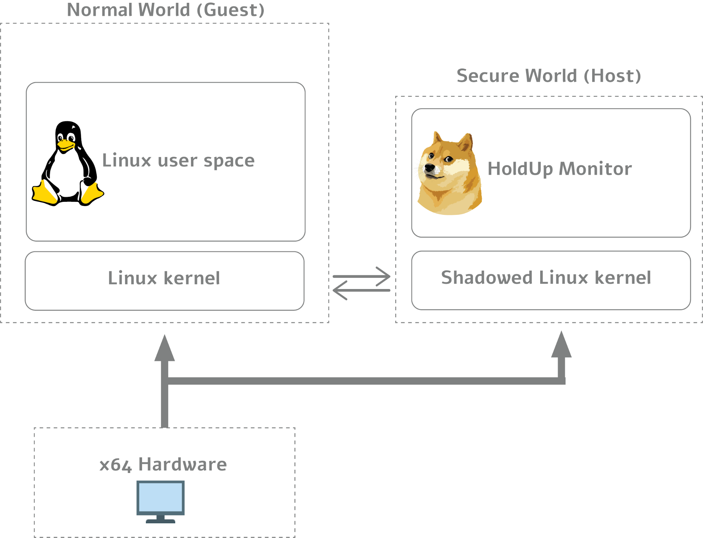

# 1. Introduction
HoldUp is a security monitoring framework for linux kernel using virtualization technologies.<br>
We made HoldUp from scratch, and it is composed of a lightweight hypervisor and a security monitor. 

* <b>The lightweight hypervisor</b>, isolates an OS inside a guest machine and projects static and dynamic kernel objects of the guest into the host machine so that our security monitor investigate the projected images. 
* <b>The security monitor</b>, places event monitors on static kernel elements and tests security of dynamic kernel elements. 


# 2. Architecture
As mentioned above, HoldUp is a security monitoring kernel module, using intricate virtualization technologies.  
We developed a security monitoring framework,that keeps an OS safe by filtering out unauthorized accesses to important kernel elements and defending the integrity of kernel elements periodically.  
HoldUp relies upon its two subparts lightweight hypervisor and a security monitor.  

<b> The lightweight hypervisor:</b>   efficiently isolates an OS inside a guest machine and projects static and dynamic kernel objects of the guest into the host machine, so that our security monitor in the host can investigate the projected images.  

<b>The security monitor:</b>  places event monitors on static kernel elements and tests security of dynamic kernel elements.<br>Running inside the host, it can test the security of the guest without malicious interference even when the guest OS is compromised.
<br><br>
HoldUp manipulates address translations from the guest physical address to the host physical address in order to exclude unauthorized accesses to the host and the hypervisor spaces. In that way, HoldUp can properly introspect the guest operating system and mediate all accesses, even when the operating system is compromised.
<br><br>
The following is a visual representation of HoldUp's architecture:



# 3. How to Build
`HoldUp supports only kernel versions from 3.19.0 until 4.14.0`  
Because HoldUp protects the code area of the kernel, it conflicts with the runtime kernel patch feature (CONFIG_JUMP_LABEL).  
Therefore, you should remove the feature. To remove it, you need to set a kernel build environment, change the kernel options, and install.  

The process is as follows:  
```bash
    # Prepare kernel source and build environment.
    $> apt-get source linux
    $> sudo apt-get build-dep linux
    $> sudo apt-get install ncurses-dev
    
    # Make new .config file.
    $> cd linux-<your_kernel_version>
    $> cp /boot/config-<your_kernel_version> .config
    $> make menuconfig
    # Load the .config file using the "Load" menu and save it to .config using the "Save" menu.
    
    $> sed -i 's/CONFIG_JUMP_LABEL=y/# CONFIG_JUMP_LABEL is not set/g' .config
    
    # Build kernel and modules.
    $> make -j8; make modules
    
    # Install kernel and modules.
    $> sudo make modules_install
    $> sudo make install

```

## 3.1  Prepare kernel symbols 
HoldUp should locate the data structures and functions for kernel integrity verification.  
These symbols can be found using kallsyms, but not all symbols are exposed to kallsyms.  
Therefore, HoldUp uses the System.map file to embed symbols and kernel versions. How to add symbols and kernel versions to HoldUp is as follows:

```bash
    # Prepare HoldUp source.
    $> git clone https://gitlab.com/RonMash/acre-066-holdup.git
    $> cd acre-066-holdup

    # Prepare kernel symbols.
    $> uname -v
    #1 SMP Tue Feb 19 16:53:04 IST 2019			<== Kernel version

    # Copy system.map file to kernel_version name.
    $> cp /boot/System.map-<your_kernel_version> system.map/"#1 SMP Tue Feb 19 16:53:04 IST 2019.map"

```

## 3.2 Config.h
HoldUp includes many optional features that run only on specific computers, read the config.h file and 
set a feature's value to 1 to run it.
For example: 
```C
// If your PC has VT-D installed, turn this feature
#define ENABLED_IOMMU	0
```
If your PC has VT-d techonoloy, enable this feature by changing its define to 1. **Notice that enabling this feature without having VT-d will cause kernel hang!**

## 3.3 Compile

```bash
    $> sudo make
```
## 3.4 Run

```bash
    $> sudo insmod holdup_main.ko
    $> dmesg
```

# 4. Use Example With adore-ng Rootkit

```bash
$> sudo insmod holdup_main.ko
$> dmesg
```

```
[17593.601379] holdup: CPU Count 4
[17593.601384] holdup: Booting CPU ID 2
[17593.615899] Alloc VMCS Memory
[17593.616272]     [*] VM[0] Alloc Host VMCS FFFF89A247868000
[17593.616273]     [*] VM[0] Alloc Guest VMCS FFFF89A24786A000
[17593.616274]     [*] VM[0] Stack Addr FFFFAD1488491000
[17593.616275]     [*] VM[0] IO bitmapA Addr FFFF89A213C5A000
[17593.616275]     [*] VM[0] IO bitmapB Addr FFFF89A213C5B000
[17593.616276]     [*] VM[0] MSR Bitmap Addr FFFF89A213C5D000
[17593.616276]     [*] VM[0] Virt APIC Page Addr FFFF89A213C5C000
[17593.616629]     [*] VM[1] Alloc Host VMCS FFFF89A224AA0000
[17593.616629]     [*] VM[1] Alloc Guest VMCS FFFF89A224AA4000
[17593.616630]     [*] VM[1] Stack Addr FFFFAD1488C92000
[17593.616631]     [*] VM[1] IO bitmapA Addr FFFF89A213C59000
[17593.616631]     [*] VM[1] IO bitmapB Addr FFFF89A224A9F000
[17593.616632]     [*] VM[1] MSR Bitmap Addr FFFF89A224A9E000
[17593.616632]     [*] VM[1] Virt APIC Page Addr FFFF89A224A9C000
[17593.617001]     [*] VM[2] Alloc Host VMCS FFFF89A224AA6000
[17593.617002]     [*] VM[2] Alloc Guest VMCS FFFF89A224AA2000
[17593.617002]     [*] VM[2] Stack Addr FFFFAD1489493000
[17593.617003]     [*] VM[2] IO bitmapA Addr FFFF89A224A9D000
[17593.617004]     [*] VM[2] IO bitmapB Addr FFFF89A224A98000
[17593.617004]     [*] VM[2] MSR Bitmap Addr FFFF89A232CD9000
[17593.617005]     [*] VM[2] Virt APIC Page Addr FFFF89A232CDC000
[17593.617396]     [*] VM[3] Alloc Host VMCS FFFF89A0D5C70000
[17593.617397]     [*] VM[3] Alloc Guest VMCS FFFF89A0D5C74000
[17593.617398]     [*] VM[3] Stack Addr FFFFAD1489C94000
[17593.617398]     [*] VM[3] IO bitmapA Addr FFFF89A232CDF000
[17593.617399]     [*] VM[3] IO bitmapB Addr FFFF89A232CDB000
[17593.617400]     [*] VM[3] MSR Bitmap Addr FFFF89A214439000
[17593.617401]     [*] VM[3] Virt APIC Page Addr FFFF89A2540A2000
[17593.629475] holdup: Protect Kernel Code Area
[17593.653099] holdup:     [*] Complete
[17593.653289] holdup: Framework Preinitialize
[17593.750434] holdup:     [*] Complete
[17593.768942] holdup: Protect Module Code Area
[17593.777305] holdup:     [*] Complete
[17593.792924] holdup: Framework Initailize
[17593.792988] holdup:     [*] Task count 233
[17593.792988] holdup:     [*] Module count 110
[17593.792989] holdup:     [*] Complete
[17593.865956] holdup: Execution Complete
```

```bash
$> sudo insmod adore-ng.ko
$> dmesg
```
```
[17758.575610] holdup: VM [3] Kernel module is loaded, current PID=18226 PPID=18225 process name=insmod module=adore_ng

[17758.577876]  ▄▄▄      ▓█████▄  ▒█████   ██▀███  ▓█████        ███▄    █   ▄████ 
[17758.577879]  ▒████▄    ▒██▀ ██▌▒██▒  ██▒▓██ ▒ ██▒▓█   ▀        ██ ▀█   █  ██▒ ▀█▒ 
[17758.577881]  ▒██  ▀█▄  ░██   █▌▒██░  ██▒▓██ ░▄█ ▒▒███    ███  ▓██  ▀█ ██▒▒██░▄▄▄░ 
[17758.577884]  ░██▄▄▄▄██ ░▓█▄   ▌▒██   ██░▒██▀▀█▄  ▒▓█  ▄  ▒▒▒  ▓██▒  ▐▌██▒░▓█  ██▓ 
[17758.577887]   ▓█   ▓██▒░▒████▓ ░ ████▓▒░░██▓ ▒██▒░▒████▒      ▒██░   ▓██░░▒▓███▀▒ 
[17758.577889]    ▒▒   ▓▒█░ ▒▒▓  ▒ ░ ▒░▒░▒░ ░ ▒▓ ░▒▓░░░ ▒░ ░      ░ ▒░   ▒ ▒  ░▒   ▒ 
[17758.577892]      ▒   ▒▒ ░ ░ ▒  ▒   ░ ▒ ▒░   ░▒ ░ ▒░ ░ ░  ░      ░ ░░   ░ ▒░  ░   ░ 
[17758.577894] 	   ░   ▒    ░ ░  ░ ░ ░ ░ ▒    ░░   ░    ░            ░   ░ ░ ░ ░   ░ 
[17758.577896] 	         ░  ░   ░        ░ ░     ░        ░  ░               ░       ░ 
[17758.577898] 			            ░                                                       
[17758.578046] holdup: VM [1] Memory attack is detected, guest linear=FFFFFFFFBC442E00 guest physical=000000001B442E00 virt_to_phys=000000011B442E00
[17758.578153] invalid opcode: 0000 [#1] SMP
[17758.578281] Modules linked in: snd_usb_audio snd_usbmidi_lib ccm rfcomm bnep arc4 intel_rapl iwlmvm x86_pkg_temp_thermal intel_powerclamp snd_hda_codec_hdmi coretemp snd_hda_codec_conexant snd_hda_codec_generic kvm_intel kvm mac80211 snd_soc_skl snd_soc_skl_ipc snd_soc_sst_ipc snd_soc_sst_dsp snd_hda_ext_core snd_soc_sst_match snd_soc_core snd_compress irqbypass ac97_bus snd_pcm_dmaengine crct10dif_pclmul crc32_pclmul ghash_clmulni_intel snd_hda_intel snd_hda_codec pcbc hp_wmi snd_hda_core sparse_keymap iwlwifi snd_hwdep snd_pcm aesni_intel snd_seq_midi aes_x86_64 crypto_simd snd_seq_midi_event glue_helper cryptd snd_rawmidi intel_cstate cfg80211 snd_seq snd_seq_device uvcvideo snd_timer videobuf2_vmalloc videobuf2_memops intel_rapl_perf videobuf2_v4l2 snd videobuf2_core videodev rtsx_pci_ms memstick
[17758.579869]  soundcore serio_raw media input_leds joydev btusb btrtl btbcm btintel bluetooth mei_me mei intel_pch_thermal shpchp hp_accel acpi_pad hp_wireless lis3lv02d mac_hid input_polldev tpm_infineon parport_pc ppdev lp parport autofs4 hid_generic usbhid hid i915 i2c_algo_bit drm_kms_helper syscopyarea sysfillrect sysimgblt fb_sys_fops drm rtsx_pci_sdmmc r8169 psmouse mii rtsx_pci ahci libahci wmi fjes video
[17758.580832] CPU: 1 PID: 18226 Comm: insmod Tainted: G           OE   4.10.0 #1
[17758.581026] Hardware name: HP HP ProBook 450 G3/8101, BIOS N78 Ver. 01.33 07/18/2018
[17758.581257] task: ffff89a2537b4500 task.stack: ffffad1481c58000
[17758.581484] RIP: 0010:init_module+0x1ac/0x1000 [adore_ng]
[17758.581670] RSP: 0018:ffffad1481c5bc70 EFLAGS: 00010286
[17758.581805] RAX: ffffffffbc442e00 RBX: ffffffffc0920080 RCX: 00000000001f22fe
[17758.581966] RDX: ffffffffbbcbb1f0 RSI: ffffffffc0924440 RDI: ffff89a257802f00
[17758.582124] RBP: ffffad1481c5bc98 R08: 000000000001c6c0 R09: ffffffffbbc541a4
[17758.582277] R10: ffffcdb147514400 R11: ffff89a210eb6338 R12: ffff89a10d6f2c00
[17758.582438] R13: 0000000000000000 R14: 0000000000000001 R15: ffffad1481c5bea8
[17758.582631] FS:  00007fa55e011700(0000) GS:ffff89a260480000(0000) knlGS:0000000000000000
[17758.582812] CS:  0010 DS: 0000 ES: 0000 CR0: 0000000080050033
[17758.582954] CR2: 00007f9ea4449000 CR3: 00000001f32a4000 CR4: 00000000003426a0
[17758.583163] DR0: 0000000000000041 DR1: 0000000000000041 DR2: 0000000000000041
[17758.583326] DR3: 0000000000000041 DR6: 0000000000000041 DR7: 0000000000000041
[17758.583493] Call Trace:
[17758.583573]  ? 0xffffffffc007e000
[17758.583670]  do_one_initcall+0x53/0x1a0
[17758.583774]  ? __vunmap+0x81/0xd0
[17758.583863]  ? kmem_cache_alloc_trace+0x13b/0x1d0
[17758.583984]  ? do_init_module+0x27/0x1ff
[17758.584098]  do_init_module+0x5f/0x1ff
[17758.584208]  load_module+0x2596/0x2950
[17758.584315]  ? __symbol_put+0x60/0x60
[17758.584422]  ? ima_post_read_file+0x7d/0xa0
[17758.584516]  ? security_kernel_post_read_file+0x6b/0x80
[17758.584655]  SYSC_finit_module+0xe6/0x120
[17758.584753]  SyS_finit_module+0xe/0x10
[17758.584860]  entry_SYSCALL_64_fastpath+0x1e/0xad
[17758.584973] RIP: 0033:0x7fa55db3f4d9
[17758.585059] RSP: 002b:00007fff1abd0498 EFLAGS: 00000202 ORIG_RAX: 0000000000000139
[17758.585241] RAX: ffffffffffffffda RBX: 00007fa55de02b20 RCX: 00007fa55db3f4d9
[17758.585410] RDX: 0000000000000000 RSI: 00005631a13c326b RDI: 0000000000000003
[17758.585575] RBP: 0000000000001011 R08: 0000000000000000 R09: 00007fa55de04ea0
[17758.585733] R10: 0000000000000003 R11: 0000000000000202 R12: 00007fa55de02b78
[17758.585889] R13: 00007fa55de02b78 R14: 000000000000270f R15: 00007fa55de031a8
[17758.586054] Code: ff fe ff 0f 22 c0 49 8b 44 24 18 48 89 15 e5 62 8a 00 48 c7 c6 40 44 92 c0 48 8b 40 30 48 8b 40 20 48 8b 10 48 89 15 8c 62 8a 00 <48> c7 00 00 df 91 c0 48 c7 c2 70 d0 91 c0 48 8b 3d 67 1e 8a 00 
[17758.586642] RIP: init_module+0x1ac/0x1000 [adore_ng] RSP: ffffad1481c5bc70
[17758.615895] ---[ end trace 31bba3b66f9e62c4 ]---
[17758.712747] holdup: VM [1] Module count is different, expect=111 real=110
[17758.712774] holdup: VM [1] Hidden module, module name="adore_ng" ptr=FFFFFFFFC0920080
```

<figure class="video_container">
  <iframe src="https://drive.google.com/file/d/1WL4YEI7pyNSVVtAmMg1nrOXzexwNAd5c/preview" frameborder="0" allowfullscreen="true"> </iframe>
</figure>


